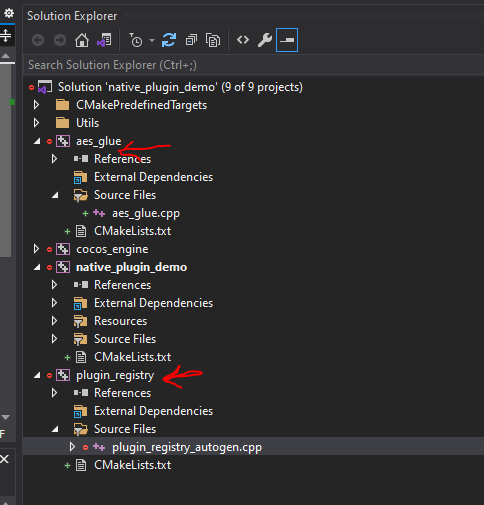
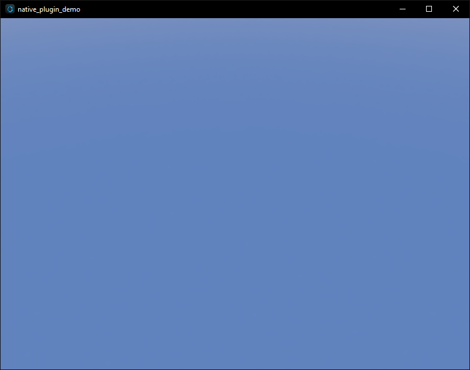
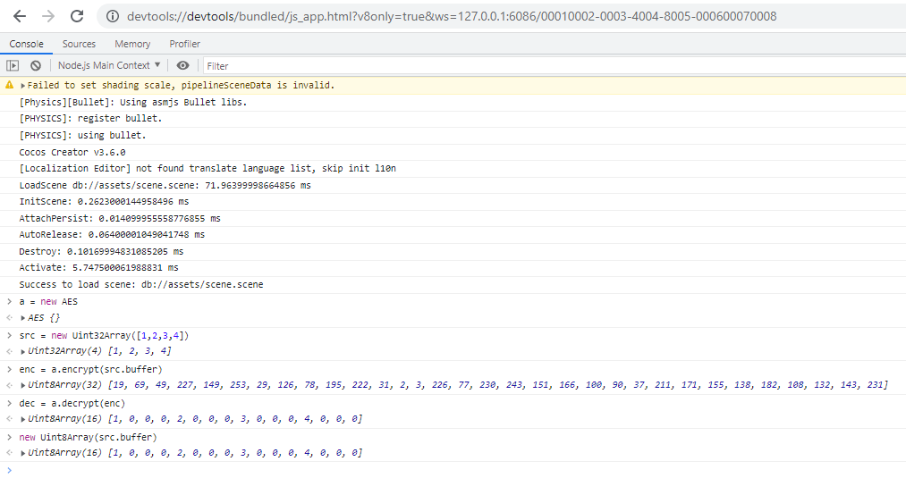
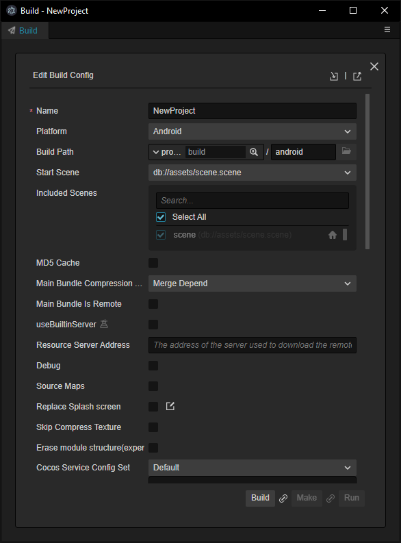

# Cocos Native Plugin Development Tutorial

## How to create a native plugin


### Create a cocos project with Cocos Creator 3.6

Start CocosCreator application, and run `Create an empty project` in chosen folder.


**Create and save a empty scene**


**Add a build for windows**


Run *Build*, `native/` folder should be created after that.

```
$ tree native/ -L 2
native/
└── engine
    ├── common
    └── win64

```

**Create a folder for plugin**

```
$ mkdir -p native/plugins/aes/windows/
```

**Copy precompiled `aes` library and header files into plugin directory**

```
$ tree native/plugins/
native/plugins/
└── aes
    ├── include
    │   └── AES.h
    └── windows
        └── lib
            ├── AES.lib
            └── AESd.lib

```

**Add files `aes_glue.cpp`, `CMakeLists.txt` and `aes_glue-config.cmake`**

```
 $ mkdir native/plugins/aes/src
 $ touch native/plugins/aes/src/aes_glue.cpp
 $ touch native/plugins/aes/src/CMakeLists.txt
 $ touch native/plugins/aes/windows/aes_glue-config.cmake
```

Now the plugin directory should looks like:

```
$ tree native/plugins/aes/
native/plugins/aes/
├── include
│   └── AES.h
├── src
│   ├── CMakeLists.txt
│   └── aes_glue.cpp
└── windows
    ├── aes_glue-config.cmake
    └── lib
        ├── AES.lib
        └── AESd.lib
```

**Edit `aes_glue-config.cmake` with following content**

```cmake
set(_AES_GLUE_DIR ${CMAKE_CURRENT_LIST_DIR})

add_library(aes STATIC IMPORTED GLOBAL)
set_target_properties(aes PROPERTIES
    IMPORTED_LOCATION ${_AES_GLUE_DIR}/lib/AES.lib
    IMPORTED_LOCATION_DEBUG ${_AES_GLUE_DIR}/lib/AESd.lib
)

include(${_AES_GLUE_DIR}/../src/CMakeLists.txt)
```

Declare a existing library `aes` add import it.

**Edit `native/plugins/aes/src/CMakeLists.cpp` with following content**

```cmake
set(_AES_GLUE_SRC_DIR ${CMAKE_CURRENT_LIST_DIR})

add_library(aes_glue ${_AES_GLUE_SRC_DIR}/aes_glue.cpp)

target_link_libraries(aes_glue
    aes
    ${ENGINE_NAME} # cocos_engine
)

target_include_directories(aes_glue PRIVATE
    ${_AES_GLUE_SRC_DIR}/../include
)
```


**Create `cc_plugin.json` in `native/plugins/aes/`**

```json
{
    "name":"simple_aes",
    "version":"0.1.0",
    "author":"cocosdemo",
    "engine-version":">=3.6.0",
    "modules":[
        {
            "target":"aes_glue"
        }
    ],
    "support-platforms":["windows"]
}

```

Let's see what we have in the plugin directory:
```
$ tree native/plugins/aes/
native/plugins/aes/
├── cc_plugin.json
├── include
│   └── AES.h
├── src
│   ├── CMakeLists.txt
│   └── aes_glue.cpp
└── windows
    ├── aes_glue-config.cmake
    └── lib
        ├── AES.lib
        └── AESd.lib
```


Now the plugin is created and enabled in this project. But it won't compile, since this no code in `aes_glue.cpp`

Let's *Build* again in build panel to refresh th Visual Studio project.

**Open the Visual Studio project under `build/windows/proj/`**

Two addtional targets are generated



If you run the target directly, you will fail with following link error:


**Edit `aes_glue.cpp`**

```c++
#include "AES.h"
#include "bindings/sebind/sebind.h"
#include "plugins/bus/EventBus.h"
#include "plugins/Plugins.h"

namespace {

std::vector<uint8_t> key = {0x00, 0x01, 0x02, 0x03, 0x04, 0x05, 0x06, 0x07,
                            0x00, 0x01, 0x02, 0x03, 0x04, 0x05, 0x06, 0x07,
                            0x00, 0x01, 0x02, 0x03, 0x04, 0x05, 0x06, 0x07,
                            0x00, 0x01, 0x02, 0x03, 0x04, 0x05, 0x06, 0x07};

std::vector<uint8_t> skipBytes = {1, 2,  3,  4,  5,  6,  7,  8,
                                  9, 10, 11, 12, 13, 14, 15, 16};

AES *aesConstructor() { return new AES(AESKeyLength::AES_256); }
std::vector<uint8_t> aesEncrypt(AES *aes, const std::vector<uint8_t> &input) {
  std::vector<uint8_t> copy = input;
  // padding
  auto appendSize = 16 - input.size() % 16;
  copy.insert(copy.end(), skipBytes.begin(), skipBytes.begin() + appendSize);
  return aes->EncryptECB(copy, key);
}

std::vector<uint8_t> aesDecrypt(AES *aes, const std::vector<uint8_t> &data) {
  std::vector<uint8_t> dec= aes->DecryptECB(data, key);
  // erase padding
  auto padding = dec.back();
  dec.erase(dec.end() - padding, dec.end());
  return dec;
}

} // namespace

// export c++ methods to JS
static bool register_aes(se::Object *ns) {

  sebind::class_<AES> klass("AES");

  klass.constructor()
      .function("encrypt", aesEncrypt)
      .function("decrypt", aesDecrypt);
  klass.install(ns);
  return true;
}

void add_aes_glue() {
  using namespace cc::plugin;
  static Listener listener(BusType::SCRIPT_ENGINE);
  listener.receive([](ScriptEngineEvent event) {
    if (event == ScriptEngineEvent::POST_INIT) {
      se::ScriptEngine::getInstance()->addRegisterCallback(register_aes);
    }
  });
}

/**
 * Regist a new cc plugin entry function
 * first  param: should match the name in cc_plugin.json
 * second param: callback when engine initialized
 */
CC_PLUGIN_ENTRY(aes_glue, add_aes_glue);
```

Start the project in debug mode, a new window should launch.



Until now, we are not sure if the plugin is enabled or not.

In the output window, we can the the debug url of devtools


Open the url with chrome.



The class `AES` and it's methods are exported successfully!

### Add support for Android


**create a folder for android**
```
$  mkdir native/plugins/aes/android
```

**Copy precompiled libraries and headers**
**create `aes_glue-config.cmake`**

The folder should looks like this:

```
$ tree native/plugins/aes/android/
native/plugins/aes/android/
├── aes_glue-config.cmake
├── arm64-v8a
│   └── lib
│       └── libaes.a
└── armeabi-v7a
    └── lib
        └── libaes.a

```

**Edit `aes_glue-config.cmake`**

```cmake
set(_AES_GLUE_DIR ${CMAKE_CURRENT_LIST_DIR})


add_library(aes STATIC IMPORTED GLOBAL)
set_target_properties(aes PROPERTIES
    IMPORTED_LOCATION ${_AES_GLUE_DIR}/${ANDROID_ABI}/lib/libaes.a
)

include(${_AES_GLUE_DIR}/../src/CMakeLists.txt)
```

**Update `aes_glue-config.cmake`

Add `android` to `support-platform` field
```json
{
    "name":"simple_aes",
    "version":"0.1.0",
    "author":"cocosdemo",
    "engine-version":">=3.6.0",
    "modules":[
        {
            "target":"aes_glue"
        }
    ],
    "support-platforms":["windows", "android"]
}

```


**Create a android build task**



Run *Build* and debug with Android Studio.


**Add support for iOS**


Prepare folder for iOS
```
 $ mkdir -p native/plugins/aes/ios/lib
```

Copy precompiled libraries and edit `native/plugins/aes/ios/aes_glue-config.cmake`

```
set(_AES_GLUE_DIR ${CMAKE_CURRENT_LIST_DIR})


add_library(aes STATIC IMPORTED GLOBAL)
set_target_properties(aes PROPERTIES
    IMPORTED_LOCATION ${_AES_GLUE_DIR}/lib/libAES.a
)

include(${_AES_GLUE_DIR}/../src/CMakeLists.txt)
```


**Add support for Mac**


Prepare folder for MacOS
```
 $ mkdir -p native/plugins/aes/mac/lib
```

Copy precompiled libraries and edit `native/plugins/aes/ios/aes_glue-config.cmake`

```
set(_AES_GLUE_DIR ${CMAKE_CURRENT_LIST_DIR})


add_library(aes STATIC IMPORTED GLOBAL)
set_target_properties(aes PROPERTIES
    IMPORTED_LOCATION ${_AES_GLUE_DIR}/lib/libAES.a
)

include(${_AES_GLUE_DIR}/../src/CMakeLists.txt)
```


Now a plugin support Android & Windows is done.

The final content of the plugins is:
```
$ tree native/plugins/aes/
native/plugins/aes
├── cc_plugin.json
├── include
│   └── AES.h
├── src
│   ├── CMakeLists.txt
│   └── aes_glue.cpp
├── android
│   ├── aes_glue-config.cmake
│   ├── arm64-v8a
│   │   └── lib
│   │       └── libaes.a
│   └── armeabi-v7a
│       └── lib
│           └── libaes.a
├── ios
│   ├── aes_glue-config.cmake
│   └── lib
│       └── libAES.a
├── mac
│   ├── aes_glue-config.cmake
│   └── lib
│       └── libAES.a
└── windows
    ├── aes_glue-config.cmake
    └── lib
        ├── AES.lib
        └── AESd.lib
```

It's ready to ship.

### Distribute with Editor Extension


