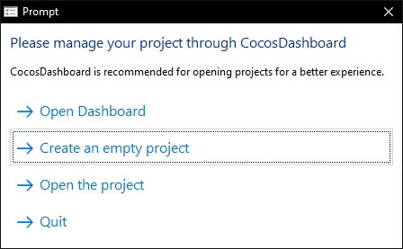
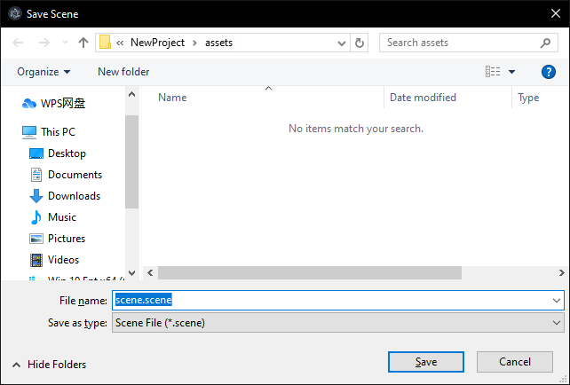

# Cocos Native Plugin Quick Tutorial

## How to create a native plugin


### Create a cocos project with Cocos Creator 3.6

Start the CocosCreator application, and run `Create an empty project` in the chosen folder.




**Create and save an empty scene**




**A native is needed to be created first to generate the `native/` directory.**

Create a build for any native platform, for example Windows


Run *Build*, `native/` folder should be created after that.

```
$ tree native/ -L 2
native/
└── engine
    ├── common
    └── win64

```

**Create a folder for the plugin**

```
$ mkdir -p native/plugins/hello_cocos
```
### Add support for Windows

Prepare the folder for Windows

```
$ mkdir -p native/plugins/hello_cocos/windows/
```

**Copy precompiled `hello_cocos` library and header files into the plugin directory**

```
$ tree native/plugins/
native/plugins/
└── hello_cocos
    ├── include
    │   └── hello_cocos.h
    └── windows
        └── lib
            ├── hello_cocos.lib
            └── hello_cocosd.lib

```

**Add files `hello_cocos_glue.cpp`, `CMakeLists.txt` and `hello_cocos_glue-config.cmake`**

```
 $ mkdir native/plugins/hello_cocos/src
 $ touch native/plugins/hello_cocos/src/hello_cocos_glue.cpp
 $ touch native/plugins/hello_cocos/src/CMakeLists.txt
 $ touch native/plugins/hello_cocos/windows/hello_cocos_glue-config.cmake
```

Now the plugin directory should look like this:

```
$ tree native/plugins/hello_cocos/
native/plugins/hello_cocos/
├── include
│   └── hello_cocos.h
├── src
│   ├── CMakeLists.txt
│   └── hello_cocos_glue.cpp
└── windows
    ├── hello_cocos_glue-config.cmake
    └── lib
        ├── hello_cocos.lib
        └── hello_cocosd.lib
```

**Edit `hello_cocos_glue-config.cmake` with following content**

```cmake
set(_hello_cocos_GLUE_DIR ${CMAKE_CURRENT_LIST_DIR})

add_library(hello_cocos STATIC IMPORTED GLOBAL)
set_target_properties(hello_cocos PROPERTIES
    IMPORTED_LOCATION ${_hello_cocos_GLUE_DIR}/lib/hello_cocos.lib
    IMPORTED_LOCATION_DEBUG ${_hello_cocos_GLUE_DIR}/lib/hello_cocosd.lib
)

include(${_hello_cocos_GLUE_DIR}/../src/CMakeLists.txt)
```

Declare an existing library `hello_cocos` add import it.

**Edit `native/plugins/hello_cocos/src/CMakeLists.txt` with following content**

```cmake
set(_hello_cocos_GLUE_SRC_DIR ${CMAKE_CURRENT_LIST_DIR})

add_library(hello_cocos_glue ${_hello_cocos_GLUE_SRC_DIR}/hello_cocos_glue.cpp)

target_link_libraries(hello_cocos_glue
    hello_cocos
    ${ENGINE_NAME} # cocos_engine
)

target_include_directories(hello_cocos_glue PRIVATE
    ${_hello_cocos_GLUE_SRC_DIR}/../include
)
```


**Create `cc_plugin.json` in `native/plugins/hello_cocos/`**

```json
{
    "name":"hello-cocos-demo",
    "version":"0.1.0",
    "author":"cocosdemo",
    "engine-version":">=3.6.0",
    "modules":[
        {
            "target":"hello_cocos_glue"
        }
    ],
    "platforms":["windows"]
}

```

Now the plugin is created and enabled in this project. But it won't compile, since there is no code in `hello_cocos_glue.cpp`

Let's *Build* again in the build panel to refresh the Visual Studio project.

**Open the Visual Studio project under `build/windows/proj/`**

Two additional targets are generated


If you run the target directly, you will fail with the following link error:


**Edit `hello_cocos_glue.cpp`**

```c++
#include "hello_cocos.h"
#include "bindings/sebind/sebind.h"
#include "plugins/bus/EventBus.h"
#include "plugins/Plugins.h"

namespace {

std::vector<uint8_t> key = {0x00, 0x01, 0x02, 0x03, 0x04, 0x05, 0x06, 0x07,
                            0x00, 0x01, 0x02, 0x03, 0x04, 0x05, 0x06, 0x07,
                            0x00, 0x01, 0x02, 0x03, 0x04, 0x05, 0x06, 0x07,
                            0x00, 0x01, 0x02, 0x03, 0x04, 0x05, 0x06, 0x07};

std::vector<uint8_t> skipBytes = {1, 2,  3,  4,  5,  6,  7,  8,
                                  9, 10, 11, 12, 13, 14, 15, 16};

hello_cocos *hello_cocosConstructor() { return new hello_cocos(hello_cocosKeyLength::hello_cocos_256); }
std::vector<uint8_t> hello_cocosEncrypt(hello_cocos *hello_cocos, const std::vector<uint8_t> &input) {
  std::vector<uint8_t> copy = input;
  // padding
  auto appendSize = 16 - input.size() % 16;
  copy.insert(copy.end(), skipBytes.begin(), skipBytes.begin() + appendSize);
  return hello_cocos->EncryptECB(copy, key);
}

std::vector<uint8_t> hello_cocosDecrypt(hello_cocos *hello_cocos, const std::vector<uint8_t> &data) {
  std::vector<uint8_t> dec= hello_cocos->DecryptECB(data, key);
  // erase padding
  auto padding = dec.back();
  dec.erase(dec.end() - padding, dec.end());
  return dec;
}

} // namespace

// export c++ methods to JS
static bool register_hello_cocos(se::Object *ns) {

  sebind::class_<hello_cocos> klass("hello_cocos");

  klass.constructor()
      .function("encrypt", hello_cocosEncrypt)
      .function("decrypt", hello_cocosDecrypt);
  klass.install(ns);
  return true;
}

void add_hello_cocos_glue() {
  using namespace cc::plugin;
  static Listener listener(BusType::SCRIPT_ENGINE);
  listener.receive([](ScriptEngineEvent event) {
    if (event == ScriptEngineEvent::POST_INIT) {
      se::ScriptEngine::getInstance()->addRegisterCallback(register_hello_cocos);
    }
  });
}

/**
 * Regist a new cc plugin entry function
 * first  param: should match the name in cc_plugin.json
 * second param: callback when engine initialized
 */
CC_PLUGIN_ENTRY(hello_cocos_glue, add_hello_cocos_glue);
```

Start the project in debug mode, a new window should launch.


Until now, we are not sure if the plugin is enabled or not.

In the output window, we can the debug URL of the devtools


Open the URL with chrome and type following code in Console
```
new Demo("World").hello("Cocos")
```


The class `hello_cocos` and its methods are exported successfully!

### Add support for Android

**Add a build for Android**

**create a folder for android**
```
$  mkdir native/plugins/hello_cocos/android
```

**Copy precompiled libraries and headers and create `hello_cocos_glue-config.cmake`**

The folder should look like this:

```
$ tree native/plugins/hello_cocos/android/
native/plugins/hello_cocos/android/
├── hello_cocos_glue-config.cmake
├── arm64-v8a
│   └── lib
│       └── libhello_cocos.a
└── armeabi-v7a
    └── lib
        └── libhello_cocos.a

```

**Edit `hello_cocos_glue-config.cmake`**

```cmake
set(_hello_cocos_GLUE_DIR ${CMAKE_CURRENT_LIST_DIR})


add_library(hello_cocos STATIC IMPORTED GLOBAL)
set_target_properties(hello_cocos PROPERTIES
    IMPORTED_LOCATION ${_hello_cocos_GLUE_DIR}/${ANDROID_ABI}/lib/libhello_cocos.a
)

include(${_hello_cocos_GLUE_DIR}/../src/CMakeLists.txt)
```

**Update `hello_cocos_glue-config.cmake`

Add `android` to `platforms` field
```json
{
    "name":"hello-cocos-demo",
    "version":"0.1.0",
    "author":"cocosdemo",
    "engine-version":">=3.6.0",
    "modules":[
        {
            "target":"hello_cocos_glue"
        }
    ],
    "platforms":["windows", "android"]
}

```


**Create an android build task**


Run *Build* and debug with Android Studio.


### Add support for iOS

**Add a build for iOS**

Prepare a folder for iOS
```
 $ mkdir -p native/plugins/hello_cocos/ios/lib
```

Copy precompiled libraries and edit `native/plugins/hello_cocos/ios/hello_cocos_glue-config.cmake`

```
set(_hello_cocos_GLUE_DIR ${CMAKE_CURRENT_LIST_DIR})


add_library(hello_cocos STATIC IMPORTED GLOBAL)
set_target_properties(hello_cocos PROPERTIES
    IMPORTED_LOCATION ${_hello_cocos_GLUE_DIR}/lib/libhello_cocos.a
)

include(${_hello_cocos_GLUE_DIR}/../src/CMakeLists.txt)
```


### Add support for Mac


**Add a build for MacOS**

Prepare a folder for MacOS
```
 $ mkdir -p native/plugins/hello_cocos/mac/lib
```

Copy precompiled libraries and edit `native/plugins/hello_cocos/ios/hello_cocos_glue-config.cmake`

```
set(_hello_cocos_GLUE_DIR ${CMAKE_CURRENT_LIST_DIR})


add_library(hello_cocos STATIC IMPORTED GLOBAL)
set_target_properties(hello_cocos PROPERTIES
    IMPORTED_LOCATION ${_hello_cocos_GLUE_DIR}/lib/libhello_cocos.a
)

include(${_hello_cocos_GLUE_DIR}/../src/CMakeLists.txt)
```

**Update `hello_cocos_glue-config.cmake` again**

Add `iOS` & `mac` to `platforms` field
```json
{
    "name":"hello-cocos-demo",
    "version":"0.1.0",
    "author":"cocosdemo",
    "engine-version":">=3.6.0",
    "modules":[
        {
            "target":"hello_cocos_glue"
        }
    ],
    "platforms":["windows", "android", "iOS", "mac"]
}

```


Now a plugin supporting Android, Windows, MacOS & iOS is done.

The final content of the plugins is:
```
$ tree native/plugins/hello_cocos/
native/plugins/hello_cocos
├── cc_plugin.json
├── include
│   └── hello_cocos.h
├── src
│   ├── CMakeLists.txt
│   └── hello_cocos_glue.cpp
├── android
│   ├── hello_cocos_glue-config.cmake
│   ├── arm64-v8a
│   │   └── lib
│   │       └── libhello_cocos.a
│   └── armeabi-v7a
│       └── lib
│           └── libhello_cocos.a
├── ios
│   ├── hello_cocos_glue-config.cmake
│   └── lib
│       └── libhello_cocos.a
├── mac
│   ├── hello_cocos_glue-config.cmake
│   └── lib
│       └── libhello_cocos.a
└── windows
    ├── hello_cocos_glue-config.cmake
    └── lib
        ├── hello_cocos.lib
        └── hello_cocosd.lib
```

It's ready to ship.

### Distribute with Editor Extension

The current upgrade process for Editor Extensions is incomplete. After the native plugin directory is packaged and published to the [Cocos Store](https://docs.cocos.com/creator/manual/en/editor/extension/store/upload-store.html). It needs to be implemented by the developer in the NodeJS environment for publishing and upgrading the native plugin.

